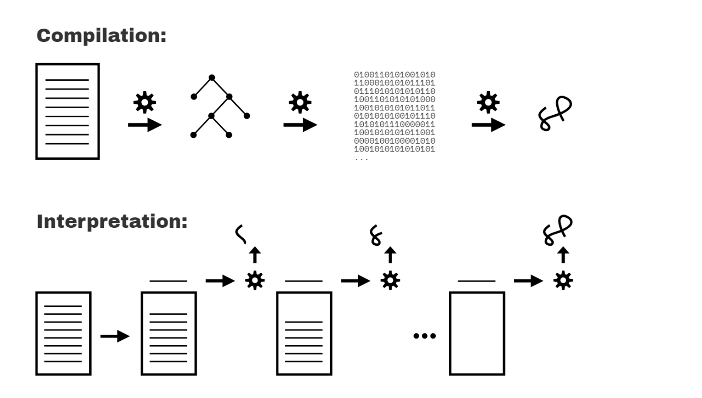

# 1. 스코프

 

- [1. 스코프](#1-스코프)
  - [1.1 책에 대하여](#11-책에-대하여)
  - [1.2 컴파일 vs 인터프리트](#12-컴파일-vs-인터프리트)
  - [1.3 코드 컴파일](#13-코드-컴파일)
  - [1.4 컴파일러체](#14-컴파일러체)
  - [1.5 런타임에 스코프 변경하기](#15-런타임에-스코프-변경하기)
  - [1.6 렉시컬 스코프](#16-렉시컬-스코프)

 

## 1.1 책에 대하여

프로그래밍 언어를 컴파일 언어와 인터프리터를 거치는 스크립트 언어로 구분하면, JS는 일반적으로 스크립트 언어로 분류됩니다. 따라서 JS로 작성한 프로그램 대부분은 위에서 아래로 한줄씩 처리된다고 가정

그런데 실제로 JS는 실행 전 별도의 단계에서 파싱,컴파일이 일어납니다.
개발자가 지정한 변수와 함수, 블록의 위치는 파싱, 컴파일 단계에서 스코프 규칙에 따라 분석되고, 그 결과에 따라 결정된 스코프 구조는 대개 런타임 조건에 영향을 받지 않습니다.

JS에서 함수는 일급값이기 때문에 숫자나 문자열처럼 변수에 할당할 수 있고, 다른 곳으로 넘기는 것도 가능합니다. 그런데 다른 곳으로 넘긴 함수 내에서 외부 변수를 사용하는 경우, 해당 변수는 어딘가에 접근해야 하므로 JS는 함수를 프로그램 내 어디에서 실행했는지와는 상관없이 정의할 때 결정된 스코프를 유지합니다. 이를 클로저라고 합니다.
 

## 1.2 컴파일 vs 인터프리트

**컴파일레이션**은 텍스트 형식으로 작성한 코드를 처리해서 컴퓨터가 이해할 수 있는 작업 지시 목록으로 바꾸는 일련의 과정입니다. 이 과정을 거치면 보통 한번에 소스 코드가 변환되는데, 변환 결과는 추후에 실행가능한 형태로 저장됩니다.

**인터프리테이션**은 개발자가 작성한 프로그램을 기계가 해석할 수 있는 명령으로 변환한다는 점에서 컴파일과 유사합니다. 하지만 처리방식이 다릅니다.

컴파일레이션은 프로그램을 한 번에 처리 
인터프리테이션은 소스 코드를 한 줄씩 변환한다는데 차이가 있습니다.

 

## 1.3 코드 컴파일

 

## 1.4 컴파일러체

 

## 1.5 런타임에 스코프 변경하기

 

## 1.6 렉시컬 스코프

 
